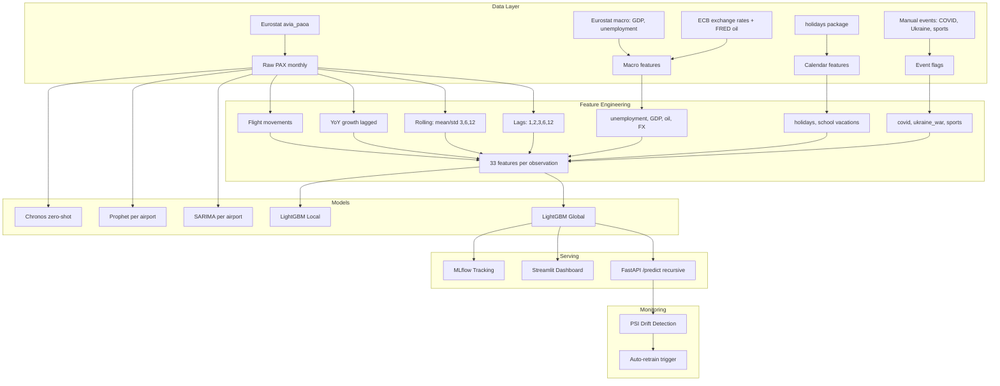

# Airport PAX Forecasting

Multi-model forecasting pipeline for monthly passenger traffic across the VINCI Airports network. Compares 5 approaches (SARIMA, LightGBM Global/Local, Prophet, Chronos) with honest recursive multi-step evaluation.

## Architecture



## Results

### Forecast Accuracy by Horizon

The key question in production is not "which model is best overall?" but **"which model at which horizon?"** Short-term (M+1–M+3) serves staffing and gate allocation; long-term (M+6–M+12) serves budgeting and route planning.

| Horizon | LightGBM Recursive | SARIMA | Best for |
|---------|-------------------|--------|----------|
| **M+1** | **1.6%** | 6.0% | Staffing, gates |
| **M+3** | **2.4%** | 5.2% | Capacity planning |
| **M+6** | **2.3%** | 6.0% | Route planning |
| **M+12** | **2.7%** | 5.2% | Budget, contracts |

LightGBM Recursive dominates all horizons with 1.6–2.7% MAPE. Adding airline supply features (`n_flights`, `pax_per_flight`) dramatically stabilized recursive predictions — Porto M+12 dropped from 20.6% to 1.6% MAPE.

### Per Airport (Test Set 2025+, one-step)

| Airport | LightGBM Global | SARIMA | Chronos | Prophet |
|---------|----------------|--------|---------|---------|
| Lyon | 3.0% | 4.1% | 2.6% | 14.3% |
| Nantes | 5.4% | 5.3% | 4.5% | 13.0% |
| Budapest | 7.2% | 7.9% | 4.0% | 29.7% |
| Lisbon | 2.9% | 3.6% | 1.9% | 17.4% |
| Porto | 4.0% | 5.3% | 3.6% | 18.5% |
| Belgrade | 3.4% | 6.9% | 3.6% | 7.4% |

### Top Features (LightGBM Global)

1. `n_flights` — commercial flight movements (1380 splits)
2. `pax_per_flight` — load factor proxy (1277)
3. `pax_lag_12` — same month last year (794)
4. `pax_lag_1` — previous month (592)
5. `oil_price_usd` — Brent crude oil price (479)

## Evaluation Methodology

### One-step vs recursive forecasting

A common pitfall in time series ML: evaluating with **one-step-ahead** predictions (using ground-truth lags from the test set) inflates accuracy because the model never sees its own errors propagate. This is valid only at M+1 where last month's actual PAX is known.

For multi-step horizons (M+3, M+6, M+12), this project uses **recursive forecasting**: predict month 1, feed that prediction back as lag input for month 2, repeat. Each prediction error compounds into subsequent months — a harder but honest evaluation.

SARIMA and Prophet are inherently multi-step (they generate a full forecast trajectory). Chronos is zero-shot on raw PAX. Only LightGBM requires this recursive treatment because it depends on lagged features.

### Feature leakage prevention

All PAX-derived features use only past values:
- Lag features: `shift(1)` through `shift(12)`
- Rolling statistics: computed on `shift(1)` to exclude current month
- YoY growth: `(pax[t-1] - pax[t-13]) / pax[t-13]` — compares last month to 13 months ago
- Network features (market share, rank): computed on lagged PAX

### Airline supply features

Adding `n_flights` (commercial flight movements from Eurostat `avia_paoa`) and `pax_per_flight` (load factor proxy) dramatically improved recursive forecasting. These supply-side features act as an anchor: even when PAX lag predictions drift, the flight count provides a stable reference for the expected traffic level. Correlation between `n_flights` and PAX ranges from 0.86 (Nantes) to 0.98 (Porto, Belgrade).

## Data Sources

| Source | Dataset | Coverage |
|--------|---------|----------|
| Eurostat | `avia_paoa` | Monthly PAX 1993–2026, all EU airports |
| Eurostat | `ei_lmhr_m` | Monthly unemployment rate by country |
| Eurostat | `namq_10_gdp` | Quarterly GDP (interpolated to monthly) |
| FRED | `POILBREUSDM` | Monthly Brent crude oil price 1992–2026 |
| ECB | EXR API | Monthly EUR/HUF, EUR/GBP exchange rates |
| Eurostat | `avia_paoa` (FLIGHT) | Monthly commercial flight movements per airport |
| `holidays` | Python package | Public holidays per country |

## Airports

| Airport | IATA | Country | Avg PAX/month | Data Range |
|---------|------|---------|---------------|------------|
| Lyon Saint-Exupéry | LYS | France | 671k | 2002–2025 |
| Nantes Atlantique | NTE | France | 329k | 2002–2025 |
| Budapest | BUD | Hungary | 832k | 2002–2026 |
| Lisbon | LIS | Portugal | 1.65M | 2004–2025 |
| Porto | OPO | Portugal | 671k | 2004–2025 |
| Belgrade | BEG | Serbia | 475k | 2016–2025 |

## Quick Start

```bash
# Install
pip install -e ".[all]"

# Download data
python scripts/download_eurostat.py
python scripts/process_eurostat.py
python scripts/download_macro_v2.py

# EDA
python scripts/eda_full.py

# Train models
python scripts/train_all_models.py
python scripts/train_chronos.py

# Evaluate by horizon
python scripts/evaluate_horizons.py

# Serve API
uvicorn airport_forecast.api:app --reload

# Dashboard
streamlit run src/airport_forecast/dashboard.py

# Tests
pytest tests/ -v

# Docker
docker compose up
```

## API Endpoints

```
GET  /airports                    List available airports
POST /predict                     Forecast PAX (airport, horizon, model)
GET  /models/{airport}/metrics    Compare models for an airport
```

Example:
```bash
curl -X POST http://localhost:8000/predict \
  -H "Content-Type: application/json" \
  -d '{"airport": "FR_LFLL", "horizon": 6, "model": "lightgbm"}'
```

## Key Findings

1. **Global model beats local models** on 5/6 airports — cross-learning between airports works. This validates the centralized Smart Data Hub approach.

2. **Airline supply data is the strongest signal.** `n_flights` (flight movements) and `pax_per_flight` (load factor) are the top 2 features by importance. Adding supply-side data cut recursive M+12 MAPE from 7.4% to 2.7%.

3. **LightGBM Recursive dominates all horizons** — 1.6% at M+1, 2.7% at M+12. Supply features anchor recursive predictions, preventing the error accumulation that previously degraded long-horizon forecasts.

4. **Prophet fails on post-COVID recovery** — it extrapolates pre-COVID trend instead of capturing the recovery pattern. LightGBM with explicit `is_covid` flag handles this correctly.

5. **Lag-12 remains a top predictor** — same month last year provides strong seasonal signal. Macro features (oil price, GDP) contribute additional predictive power beyond the supply and demand lags.

## Operational Decision Support

Forecasts are only valuable if they trigger actions. Here's how each horizon maps to airport operations:

| Forecast Signal | Horizon | Operational Decision |
|----------------|---------|---------------------|
| PAX M+1 > +15% vs N-1 | Short-term | Open additional boarding gates, reinforce ground staff |
| PAX M+1 < -10% vs N-1 | Short-term | Reduce shifts, consolidate check-in desks |
| PAX M+3 seasonal peak | Medium-term | Pre-negotiate temporary staff contracts, expand retail hours |
| PAX M+6 sustained growth | Medium-term | Plan terminal capacity upgrades, add parking slots |
| PAX M+12 > +20% vs N-1 | Strategic | Renegotiate airline agreements, budget for infrastructure |
| PAX M+12 decline trend | Strategic | Attract new carriers (incentive packages), diversify revenue |
| Drift alert (PSI > 0.25) | Monitoring | Trigger model retraining, investigate root cause |

In VINCI's Smart Data Hub context, these forecasts would feed into:
- **Staffing optimization** (security, check-in, baggage handling)
- **Commercial revenue planning** (retail, F&B, parking)
- **Airline relationship management** (slot allocation, route development incentives)
- **Infrastructure investment** (terminal expansion triggers, capex planning)

## Limitations & Next Steps

- **Flight data as exogenous input**: `n_flights` is the top predictor but requires future flight schedules for true out-of-sample forecasting. In production, airlines publish schedules 6+ months ahead (OAG, Cirium), making this feasible. For longer horizons, a flight-count forecast model could feed the PAX model (two-stage approach).
- **Macro extrapolation**: recursive forecasts beyond available macro data require forward-filling exchange rates, oil prices, and GDP. A production system would integrate macro forecasts (ECB projections, futures curves).
- **No Kubeflow/Airflow orchestration**: the pipeline runs as scripts. A production deployment would use Kubeflow Pipelines or Airflow for scheduling, versioning, and automated retraining.
- **Chronos stability**: Chronos shows high variance across airports (1.9% Lisbon vs 66.6% on a single validation window). Fine-tuning on aviation data could stabilize it.
- **Tourism data**: integrating hotel occupancy (Eurostat `tour_occ_nim`) or Google Trends search volume as leading indicators could further improve forecasts for leisure-heavy airports (Lisbon, Porto).

## Transposition to VINCI Smart Data Hub

This pipeline maps directly to VINCI Airports' Smart Data Hub:

- **Scale**: the global model architecture handles 70+ airports — add an airport by adding rows, no architecture change
- **Cold start**: a new airport in the network benefits from cross-learning immediately
- **Operational use**: LightGBM Recursive at M+1 to M+6 for staffing, gate allocation, capacity planning
- **Strategic use**: SARIMA at M+12 for budgeting, airline contract negotiation
- **Monitoring**: PSI drift detection triggers automatic retraining when distributions shift

## Project Structure

```
airport-forecasting/
├── src/airport_forecast/
│   ├── api.py              FastAPI serving (recursive forecast)
│   ├── constants.py        Airport codes, horizons
│   ├── dashboard.py        Streamlit UI (4 tabs)
│   ├── data.py             Data loading
│   ├── features.py         Feature engineering (33 features)
│   ├── models.py           SARIMA, LightGBM, Prophet, Chronos, Ensemble
│   ├── mlflow_tracking.py  MLflow experiment logging
│   ├── monitoring.py       PSI drift detection
│   └── logging_config.py   Logging setup
├── scripts/                Data download, EDA, training, evaluation
├── tests/                  30 tests (data, features, models, API, monitoring)
├── data/                   Raw + processed datasets
├── reports/                Results CSV, horizon analysis, 25 EDA plots
├── Dockerfile
├── docker-compose.yml
└── .github/workflows/ci.yml
```

## Tech Stack

Python, LightGBM, statsmodels (SARIMA), Prophet, Chronos (Amazon), FastAPI, Streamlit, MLflow, Optuna, Docker, pytest, GitHub Actions
