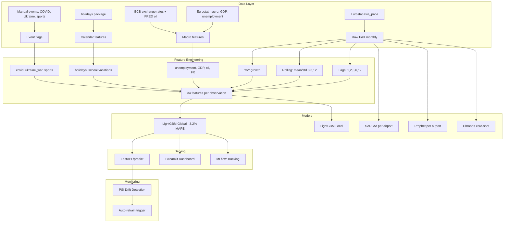

# Airport PAX Forecasting

Multi-model forecasting pipeline for monthly passenger traffic across the VINCI Airports network.

## Architecture



## Results

| Model | Avg MAPE | Description |
|-------|----------|-------------|
| **LightGBM Global** | **3.2%** | Gradient boosting, all airports pooled, 34 features |
| LightGBM Local | 6.7% | Per-airport LightGBM |
| SARIMA | 7.0% | Statistical baseline, per airport |
| Chronos | 7.8% | Amazon foundation model, zero-shot |
| Prophet | 17.9% | Meta's decomposition model |

### Per Airport (Test Set 2025+)

| Airport | LightGBM Global | SARIMA | Chronos | Prophet |
|---------|----------------|--------|---------|---------|
| Lyon | 2.0% | 4.1% | 2.4% | 14.3% |
| Nantes | 4.2% | 5.3% | 4.8% | 13.0% |
| Budapest | 3.6% | 7.9% | 7.2% | 29.7% |
| Lisbon | 6.4% | 3.6% | 2.3% | 17.4% |
| Porto | 1.7% | 5.3% | 4.1% | 18.5% |
| Belgrade | 2.7% | 6.9% | 7.4% | 7.4% |

### Top Features (LightGBM Global)

1. `pax_lag_12` — same month last year
2. `pax_yoy_growth` — year-over-year momentum
3. `pax_lag_1` — previous month
4. `month_cos` — seasonal encoding
5. `oil_price_usd` — Brent crude oil price

## Data Sources

| Source | Dataset | Coverage |
|--------|---------|----------|
| Eurostat | `avia_paoa` | Monthly PAX 1993-2026, all EU airports |
| Eurostat | `ei_lmhr_m` | Monthly unemployment rate by country |
| Eurostat | `namq_10_gdp` | Quarterly GDP (interpolated to monthly) |
| FRED | `POILBREUSDM` | Monthly Brent crude oil price 1992-2026 |
| ECB | EXR API | Monthly EUR/HUF, EUR/GBP exchange rates |
| `holidays` | Python package | Public holidays per country |

## Airports

| Airport | IATA | Country | Avg PAX/month | Data Range |
|---------|------|---------|---------------|------------|
| Lyon Saint-Exupery | LYS | France | 671k | 2002-2025 |
| Nantes Atlantique | NTE | France | 329k | 2002-2025 |
| Budapest | BUD | Hungary | 832k | 2002-2026 |
| Lisbon | LIS | Portugal | 1.65M | 2004-2025 |
| Porto | OPO | Portugal | 671k | 2004-2025 |
| Belgrade | BEG | Serbia | 475k | 2016-2025 |

## Quick Start

```bash
# Install
pip install -e ".[all]"

# Download data
python scripts/download_eurostat.py
python scripts/process_eurostat.py
python scripts/download_macro_v2.py

# EDA
python scripts/eda_full.py

# Train models
python scripts/train_all_models.py
python scripts/train_chronos.py

# Serve API
uvicorn airport_forecast.api:app --reload

# Dashboard
streamlit run src/airport_forecast/dashboard.py

# Tests
pytest tests/ -v

# Docker
docker compose up
```

## API Endpoints

```
GET  /airports                    List available airports
POST /predict                     Forecast PAX (airport, horizon, model)
GET  /models/{airport}/metrics    Compare models for an airport
```

Example:
```bash
curl -X POST http://localhost:8000/predict \
  -H "Content-Type: application/json" \
  -d '{"airport": "FR_LFLL", "horizon": 6, "model": "lightgbm"}'
```

## Key Findings

1. **Global model beats local models** on 5/6 airports — cross-learning between airports works. This validates the centralized Smart Data Hub approach.

2. **Lag-12 is the strongest predictor** — same month last year is the best signal. Macro-economic features (oil price, GDP) provide additional predictive power.

3. **Prophet fails on post-COVID recovery** — it extrapolates pre-COVID trend instead of capturing the recovery pattern. LightGBM with explicit `is_covid` flag handles this correctly.

4. **Chronos (zero-shot) is competitive at 7.8% MAPE** without any training, but a trained model with domain features does 2x better.

## Transposition to VINCI Smart Data Hub

This pipeline is directly applicable to VINCI Airports' Smart Data Hub:

- **Scale**: the global model architecture handles 70+ airports — add an airport by adding it to the dataset, no retraining architecture needed
- **Cold start**: a new airport in the network benefits from cross-learning immediately
- **Operational use**: short-term forecasts (M+1 to M+3) for staffing, gate allocation, capacity planning
- **Strategic use**: long-term forecasts (M+6 to M+12) for budgeting, airline contract negotiation
- **Monitoring**: PSI drift detection triggers automatic retraining when distributions shift

## Project Structure

```
airport-forecasting/
├── src/airport_forecast/
│   ├── api.py              FastAPI serving
│   ├── constants.py        Airport codes, horizons
│   ├── dashboard.py        Streamlit UI
│   ├── data.py             Data loading
│   ├── features.py         Feature engineering (34 features)
│   ├── holidays_features.py Calendar enrichment
│   ├── models.py           SARIMA, LightGBM, Prophet, Chronos
│   └── monitoring.py       PSI drift detection
├── scripts/                Data download, EDA, training
├── tests/                  17 tests (data, features, monitoring)
├── data/                   Raw + processed datasets
├── reports/                Results CSV + 25 EDA plots
├── Dockerfile
├── docker-compose.yml
└── .github/workflows/ci.yml
```

## Tech Stack

Python, LightGBM, statsmodels (SARIMA), Prophet, Chronos (Amazon), FastAPI, Streamlit, MLflow, Docker, pytest, GitHub Actions
