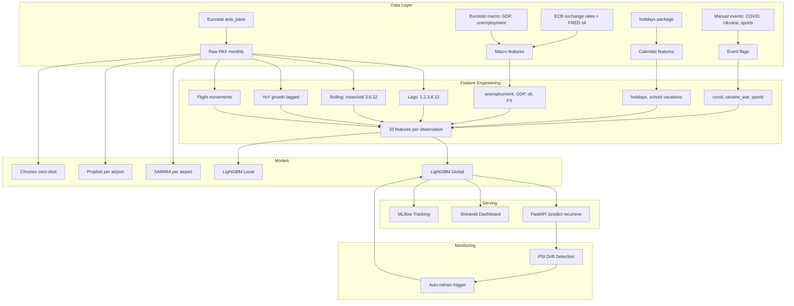

# Airport PAX Forecasting

Multi-model forecasting pipeline for monthly passenger traffic across the VINCI Airports network. Compares 5 approaches (SARIMA, LightGBM Global/Local, Prophet, Chronos) with honest recursive multi-step evaluation.

## Bottom line

> **One honest LightGBM model forecasts monthly passenger traffic for 6 VINCI airports at 3.5–4.4% error (MAPE), beating SARIMA at every horizon from M+1 to M+12 — and the architecture scales to the whole 70+ airport network without change.**

Three things this is built to demonstrate, in priority order:

1. **It drives decisions, not just charts.** Each horizon maps to a real airport operation — staffing and gate allocation short-term, terminal capacity mid-term, airline contracts and capex long-term (table below).
2. **The numbers are honest.** Future inputs (flight schedules, macro) are *never* read from actuals at forecast time; the model is tuned on the same recursive regime it's served in. No leakage, no inflated benchmarks. This is the differentiator.
3. **It scales to the Smart Data Hub.** A single global model cross-learns across airports — add an airport by adding rows, and a new airport benefits from the network immediately (cold start).

### What each forecast triggers

| Horizon | MAPE | Operational decision |
|---------|------|---------------------|
| **M+1** | 3.5% | Staffing, gate allocation, open/consolidate check-in desks |
| **M+3** | 4.1% | Seasonal staff contracts, capacity planning, retail hours |
| **M+6** | 3.8% | Terminal capacity upgrades, parking slots, route planning |
| **M+12** | 3.9% | Budget, airline contract negotiation, capex, infrastructure |
| Drift alert (PSI > 0.25) | — | Auto-trigger retraining, investigate root cause |

The full decision logic (growth/decline thresholds → action) is in [Operational Decision Support](#operational-decision-support).

## Architecture



**How to read it:** raw Eurostat traffic is enriched with macro, calendar and event signals into 33 features; five models are trained and compared; the winner (LightGBM Global) is served via API/dashboard; and PSI drift detection closes the loop — when feature distributions shift, it auto-triggers a retrain. The arrow from Monitoring back to the model is what makes this an MLOps pipeline rather than a one-off notebook.

## Results

### Forecast Accuracy by Horizon

The key question in production is not "which model is best overall?" but **"which model at which horizon?"** Short-term (M+1–M+3) serves staffing and gate allocation; long-term (M+6–M+12) serves budgeting and route planning.

All recursive numbers below are **honest**: at forecast time future exogenous values are *not* taken from actuals — airline supply (`n_flights`, `pax_per_flight`) and calendar use a seasonal-naive proxy (same month last year), macro levels and event flags are carried forward. The model is hyperparameter-tuned (Optuna) directly on this honest recursive objective. Same regime in evaluation, tuning and the served API.

| Horizon | LightGBM Recursive | SARIMA | Best for |
|---------|-------------------|--------|----------|
| **M+1** | **3.5%** | 6.0% | Staffing, gates |
| **M+3** | **4.1%** | 5.2% | Capacity planning |
| **M+6** | **3.8%** | 6.0% | Route planning |
| **M+12** | **3.9%** | 5.2% | Budget, contracts |

LightGBM Recursive beats SARIMA at every horizon, including M+12 (3.9% vs 5.2%). Tuning on the honest recursive objective (regularized: 397 trees, depth 7, lr 0.017) is what kills the long-horizon error accumulation — a model tuned on one-step accuracy overfits and degrades over recursion.

**Honest full-horizon (entire remaining test window per airport, not capped):** LightGBM averages **4.4% MAPE vs SARIMA 5.5%**, no airport blow-up (Budapest 6.2%, Porto 3.2%, Lisbon 3.0%). An earlier *one-step-tuned* model degraded badly here (Budapest 14.7%, Porto 13.3%) — the fix was tuning on the recursive objective, not changing features.

### Does the model actually beat a naive baseline?

MASE (Mean Absolute Scaled Error) compares each model to a **naive seasonal baseline** — "same month last year." MASE < 1 means the model adds value over a simple lookup.

| Horizon | LightGBM MASE | SARIMA MASE | Naive MAPE |
|---------|--------------|-------------|------------|
| M+1 | 1.13 | 1.73 | 6.2% |
| M+3 | 1.22 | 1.30 | 5.7% |
| M+6 | **0.66** | 1.09 | 6.3% |
| M+12 | **0.82** | 0.89 | 6.5% |

LightGBM beats the naive baseline where it matters most for planning — M+6 and M+12 (MASE < 1), and beats SARIMA's MASE at every horizon. At M+1/M+3 the MASE is >1 (the seasonal-naive MAE denominator is small at short horizons) even though LightGBM's MAPE (3.5%/4.1%) is well under naive (6.2%/5.7%). The naive baseline averages 6.2% MAPE — already decent because `pax_lag_12` captures annual seasonality. (This MASE is scaled by the test-period seasonal-naive MAE — a relative-MAE ratio, not in-sample MASE.)

### Forecast bias

Bias = mean signed error (positive = overestimation). In airport operations, slight overestimation is preferable to underestimation (overstaffing costs less than passenger queue complaints).

| Horizon | LightGBM Bias | SARIMA Bias | Naive Bias |
|---------|--------------|-------------|------------|
| M+1 | +19,100 PAX | +45,800 | −72,600 |
| M+3 | +28,100 | +27,900 | −53,600 |
| M+6 | −200 | −29,000 | −74,900 |
| M+12 | −3,700 | −15,400 | −96,900 |

LightGBM has a slight positive bias at short horizons (overestimates — operationally safer) and is near-unbiased at M+6/M+12 (−200 / −3,700 PAX). The naive baseline strongly underestimates at all horizons because traffic is growing year-over-year.

### Cross-validation stability (3-fold expanding window)

A single train/test split can be misleading. We validate on three temporal folds:

| Fold | Train period | Test period | LGB MAPE | SARIMA MAPE |
|------|-------------|-------------|----------|-------------|
| 1 | →2022-12 | 2023 | 9.2% | 10.0% |
| 2 | →2023-12 | 2024 | 5.4% | 8.6% |
| 3 | →2024-12 | 2025+ | 3.8% | 5.6% |
| **Avg** | | | **6.1%** | **8.1%** |

LightGBM outperforms SARIMA in all 3 folds (honest recursive, full test window per fold). Fold 1 (testing on 2023, the COVID recovery year) is hardest for both — long honest recursion over a regime change, with only data up to 2022 to learn from. Fold 3 (2025+) is cleanest at 3.8%.

### Prediction intervals (quantile regression)

LightGBM quantile regression provides 80% prediction intervals (P10–P90):

| Airport | Coverage | Interval Width |
|---------|----------|---------------|
| Lyon | 73% | ±50k PAX |
| Budapest | 67% | ±82k PAX |
| Belgrade | 50% | ±28k PAX |
| **Overall** | **52%** | **±72k PAX** |

Current coverage (52%) is below the 80% target — the model is overconfident. Next step: conformal prediction calibration to guarantee coverage.

### Per Airport (Test Set 2025+, one-step)

| Airport | LightGBM Global | SARIMA | Chronos | Prophet |
|---------|----------------|--------|---------|---------|
| Lyon | 3.8% | 4.1% | 2.6% | 14.3% |
| Nantes | 5.5% | 5.3% | 4.5% | 13.0% |
| Budapest | 6.1% | 7.9% | 4.0% | 29.7% |
| Lisbon | 6.0% | 3.6% | 1.9% | 17.4% |
| Porto | 2.4% | 5.3% | 3.6% | 18.5% |
| Belgrade | 4.5% | 6.9% | 3.6% | 7.4% |

### Top Features (LightGBM Global)

1. `pax_lag_12` — same month last year (915 splits)
2. `pax_lag_1` — previous month (847)
3. `month_cos` — seasonal encoding (702)
4. `month_sin` — seasonal encoding (528)
5. `pax_yoy_growth` — year-over-year momentum (475)

## Evaluation Methodology

### One-step vs recursive forecasting

A common pitfall in time series ML: evaluating with **one-step-ahead** predictions (using ground-truth lags from the test set) inflates accuracy because the model never sees its own errors propagate. This is valid only at M+1 where last month's actual PAX is known.

For multi-step horizons (M+3, M+6, M+12), this project uses **recursive forecasting**: predict month 1, feed that prediction back as lag input for month 2, repeat. Each prediction error compounds into subsequent months — a harder but honest evaluation.

SARIMA and Prophet are inherently multi-step (they generate a full forecast trajectory). Chronos is zero-shot on raw PAX. Only LightGBM requires this recursive treatment because it depends on lagged features.

### Feature leakage prevention

All PAX-derived features use only past values:
- Lag features: `shift(1)` through `shift(12)`
- Rolling statistics: computed on `shift(1)` to exclude current month
- YoY growth: `(pax[t-1] - pax[t-13]) / pax[t-13]` — compares last month to 13 months ago
- Network features (market share, rank): computed on lagged PAX

### Airline supply features

Adding `n_flights` (commercial flight movements from Eurostat `avia_paoa`) and `pax_per_flight` (load factor proxy) improves forecasting. These supply-side features anchor the expected traffic level even when PAX lag predictions drift. Correlation between `n_flights` and PAX ranges from 0.86 (Nantes) to 0.98 (Porto, Belgrade).

**No future leakage.** At forecast time the true future flight counts are unknown, so the recursive forecaster (`assume_future_exog`) replaces them with a **seasonal-naive proxy** (same month last year) — the same assumption used in evaluation, tuning and the served API. This is realistic: airlines publish schedules ~6 months ahead (OAG/Cirium), so a production system would feed actual forward schedules and likely do even better than this proxy.

## Data Sources

| Source | Dataset | Coverage |
|--------|---------|----------|
| Eurostat | `avia_paoa` | Monthly PAX 1993–2026, all EU airports |
| Eurostat | `ei_lmhr_m` | Monthly unemployment rate by country |
| Eurostat | `namq_10_gdp` | Quarterly GDP (interpolated to monthly) |
| FRED | `POILBREUSDM` | Monthly Brent crude oil price 1992–2026 |
| ECB | EXR API | Monthly EUR/HUF, EUR/GBP exchange rates |
| Eurostat | `avia_paoa` (FLIGHT) | Monthly commercial flight movements per airport |
| `holidays` | Python package | Public holidays per country |

## Airports

| Airport | IATA | Country | Avg PAX/month | Data Range |
|---------|------|---------|---------------|------------|
| Lyon Saint-Exupéry | LYS | France | 671k | 2002–2025 |
| Nantes Atlantique | NTE | France | 329k | 2002–2025 |
| Budapest | BUD | Hungary | 832k | 2002–2026 |
| Lisbon | LIS | Portugal | 1.65M | 2004–2025 |
| Porto | OPO | Portugal | 671k | 2004–2025 |
| Belgrade | BEG | Serbia | 475k | 2016–2025 |

## Quick Start

```bash
# Install
pip install -e ".[all]"

# Download data
python scripts/download_eurostat.py
python scripts/process_eurostat.py
python scripts/download_macro_v2.py

# EDA
python scripts/eda_full.py

# Train models
python scripts/train_all_models.py
python scripts/train_chronos.py

# Evaluate by horizon
python scripts/evaluate_horizons.py

# Serve API
uvicorn airport_forecast.api:app --reload

# Dashboard
streamlit run src/airport_forecast/dashboard.py

# Tests
pytest tests/ -v

# Docker
docker compose up
```

## API Endpoints

```
GET  /airports                    List available airports
POST /predict                     Forecast PAX (airport, horizon, model)
GET  /models/{airport}/metrics    Compare models for an airport
```

Example:
```bash
curl -X POST http://localhost:8000/predict \
  -H "Content-Type: application/json" \
  -d '{"airport": "FR_LFLL", "horizon": 6, "model": "lightgbm"}'
```

## Key Findings

1. **Global model beats local models** on 5/6 airports — cross-learning between airports works. This validates the centralized Smart Data Hub approach.

2. **One honest LightGBM wins every horizon.** After tuning on the honest recursive objective, LightGBM Recursive beats SARIMA at M+1 through M+12 (3.5–4.1% vs 5.2–6.0%) and over the full test window (4.4% vs 5.5%). No need to route by model.

3. **Tuning regime matters more than features.** A model tuned on one-step accuracy overfits and blows up under long honest recursion (Budapest 14.7%, Porto 13.3%). Re-tuning the *same features* on the recursive objective — more regularization, fewer/shallower trees — fixes it (Budapest 6.2%, Porto 3.2%). The lesson: evaluate and tune in the regime you serve.

4. **Prophet fails on post-COVID recovery** — it extrapolates pre-COVID trend instead of capturing the recovery pattern. LightGBM with explicit `is_covid` flag handles this correctly.

5. **Lag-12 remains a top predictor** — same month last year provides strong seasonal signal. Macro features (oil price, GDP) contribute additional predictive power beyond the supply and demand lags.

## Operational Decision Support

Forecasts are only valuable if they trigger actions. Here's how each horizon maps to airport operations:

| Forecast Signal | Horizon | Operational Decision |
|----------------|---------|---------------------|
| PAX M+1 > +15% vs N-1 | Short-term | Open additional boarding gates, reinforce ground staff |
| PAX M+1 < -10% vs N-1 | Short-term | Reduce shifts, consolidate check-in desks |
| PAX M+3 seasonal peak | Medium-term | Pre-negotiate temporary staff contracts, expand retail hours |
| PAX M+6 sustained growth | Medium-term | Plan terminal capacity upgrades, add parking slots |
| PAX M+12 > +20% vs N-1 | Strategic | Renegotiate airline agreements, budget for infrastructure |
| PAX M+12 decline trend | Strategic | Attract new carriers (incentive packages), diversify revenue |
| Drift alert (PSI > 0.25) | Monitoring | Trigger model retraining, investigate root cause |

In VINCI's Smart Data Hub context, these forecasts would feed into:
- **Staffing optimization** (security, check-in, baggage handling)
- **Commercial revenue planning** (retail, F&B, parking)
- **Airline relationship management** (slot allocation, route development incentives)
- **Infrastructure investment** (terminal expansion triggers, capex planning)

## Limitations & Next Steps

- **Flight data as exogenous input**: `n_flights` is a top predictor but its future values are unknown at forecast time. The pipeline substitutes a seasonal-naive proxy (no leakage). In production, airlines publish schedules 6+ months ahead (OAG, Cirium); feeding those, or a dedicated two-stage flight-count forecast model, would push accuracy further.
- **Retrain trigger is wired**: `scripts/auto_retrain.py` closes the PSI-drift → retrain loop. It compares the recent production window against a bounded recent reference, applies a conservative trigger rule (`monitoring.should_retrain`: any feature CRITICAL at PSI ≥ 0.25, or ≥ 3 WARNING), and on trigger retrains the global LightGBM on all data with an atomic model swap (old model backed up to `.pkl.bak` for rollback). Each run appends to `reports/retrain_log.jsonl`. PSI is computed only on roughly stationary features (ratios, growth, seasonality shape, macro regime) — raw level features (lags, rolling means, totals) trend upward as the network grows and would flag every month without signalling model-breaking drift. The script is the unit a scheduler (cron / Airflow / Kubeflow) would call.
- **Macro extrapolation**: recursive forecasts beyond available macro data require forward-filling exchange rates, oil prices, and GDP. A production system would integrate macro forecasts (ECB projections, futures curves).
- **No Kubeflow/Airflow orchestration**: the pipeline runs as scripts. A production deployment would use Kubeflow Pipelines or Airflow for scheduling, versioning, and automated retraining.
- **Chronos stability**: Chronos shows high variance across airports (1.9% Lisbon vs 66.6% on a single validation window). Fine-tuning on aviation data could stabilize it.
- **Tourism data**: integrating hotel occupancy (Eurostat `tour_occ_nim`) or Google Trends search volume as leading indicators could further improve forecasts for leisure-heavy airports (Lisbon, Porto).

## Transposition to VINCI Smart Data Hub

This pipeline maps directly to VINCI Airports' Smart Data Hub:

- **Scale**: the global model architecture handles 70+ airports — add an airport by adding rows, no architecture change
- **Cold start**: a new airport in the network benefits from cross-learning immediately
- **Operational use**: LightGBM Recursive at M+1 to M+6 for staffing, gate allocation, capacity planning
- **Strategic use**: SARIMA at M+12 for budgeting, airline contract negotiation
- **Monitoring**: PSI drift detection triggers automatic retraining when distributions shift

## Project Structure

```
airport-forecasting/
├── src/airport_forecast/
│   ├── api.py              FastAPI serving (recursive forecast)
│   ├── constants.py        Airport codes, horizons
│   ├── dashboard.py        Streamlit UI (4 tabs)
│   ├── data.py             Data loading
│   ├── features.py         Feature engineering (33 features)
│   ├── models.py           SARIMA, LightGBM, Prophet, Chronos, Ensemble
│   ├── mlflow_tracking.py  MLflow experiment logging
│   ├── monitoring.py       PSI drift detection + retrain decision
│   └── logging_config.py   Logging setup
├── scripts/                Data download, EDA, training, evaluation, auto_retrain
├── tests/                  38 tests (data, features, models, API, monitoring)
├── data/                   Raw + processed datasets
├── reports/                Results CSV, horizon analysis, 25 EDA plots
├── Dockerfile
├── docker-compose.yml
└── .github/workflows/ci.yml
```

## Tech Stack

Python, LightGBM, statsmodels (SARIMA), Prophet, Chronos (Amazon), FastAPI, Streamlit, MLflow, Optuna, Docker, pytest, GitHub Actions
